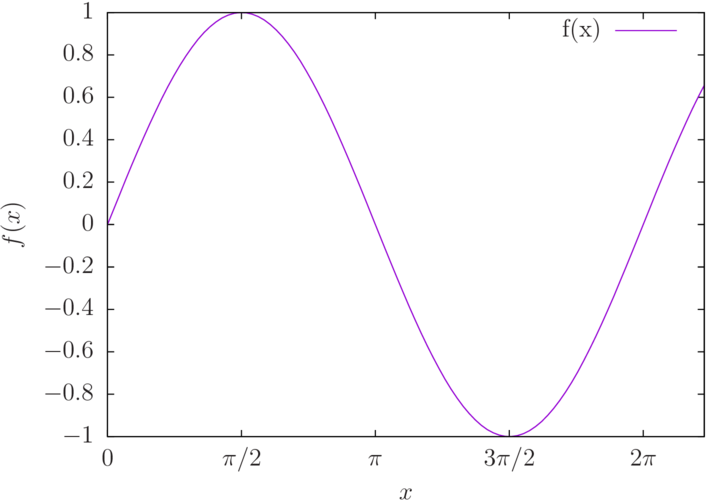

# Gnuplot: Generación de archivos pdf con sintaxis LaTeX  #

La forma más fácil que he encontrado para generar un archivo en pdf a partir de un script, que contenga la sintaxis de `LaTeX`, es mediante el uso de un script del `shell`.

Primero vamos a generar un `script` para `gnuplot`, lo guardamos en un archivo llamado `sin.gp`.

	reset

	set xlab "$x$"
	set ylab "$f(x)$"
	set xtics("0" 0, "$\\pi/2$" pi/2, "$\\pi$" pi, "$3\\pi/2$" 3*pi/2, "$2 \\pi$" 2*pi)
	set xrange[0:7]

	f(x) = sin(x)

	plot f(x)

Como se pueden dar se cuenta ya esta incluida la sintaxis de `LaTeX` en las etiquetas. A partir del archivo `sin.gp` vamos a exportar el archivo `eps` y el `tex` para posteriormente generar el pdf. Para exportarlo ejecutamos ejecutamos el siguiente comando desde `gnuplot`:

	> load 'sin.gp'
	> set terminal epsl col sol lw 2
	> set output 'sin.tex'
	> rep
	
Esto nos genera los archivos `sin.eps` y `sin.tex`, el primero contiene la imagen y el segundo todas las etiquetas de la gráfica. Ahora lo que necesitamos es un archivo `LaTeX` para compilar el archivo `sin.tex`, como el que se muestra continuación.

	\documentclass{article}
	\usepackage{graphicx}
	\usepackage{color}
	\usepackage{amsmath}
	\usepackage{amssymb}
	\renewcommand{\v}[1]{{\boldsymbol #1}}

	\newcommand{\PROM}[1]{\left\langle #1\right\rangle}
	\pagestyle{empty}
	\begin{document}
	\large
	\input{sin}

	\end{document}

El texto anterior lo podemos guardar en un archivo llamado `fig.tex`. Por ultimo, desde la terminal, compilamos el archivo `fig.tex` y generamos el archivo `sin.pdf`

	latex fig
	dvips E fig o fig.eps
	epstopdf fig.eps o sin.pdf

El proceso anterior es muy laborioso, sobre todo si lo hacemos de manera frecuente. Por lo que vamos a realizar un script en el shell, que incluye todo el proceso anterior, para hacerlo de manera automática, a partir de un script de gnuplot.

Creamos un archivo `gp2pdf.sh` y ahí colocamos el siguiente texto:

	#!/bin/bash

	name=`basename $1`

	name=${name%.gp}

	echo "load '$name.gp'
	set terminal epsl col sol lw 2
	set output '${name}.tex'
	rep" | gnuplot

	# Genera el archivo fig.tex
	echo '\documentclass{article}' > fig.tex
	echo '\usepackage{graphicx}' >> fig.tex
	echo '\usepackage{color}' >> fig.tex
	echo '\usepackage{amsmath}' >> fig.tex
	echo '\usepackage{amssymb}' >> fig.tex
	echo '\renewcommand{\v}[1]{{\boldsymbol #1}}'  >> fig.tex
	echo '' >> fig.tex
	echo '\newcommand{\PROM}[1]{\left\langle #1\right\rangle}' >> fig.tex
	echo '\pagestyle{empty}' >> fig.tex
	echo '\begin{document}' >> fig.tex
	echo '\large' >> fig.tex
	echo '\input{'$name'}' >> fig.tex
	echo '' >> fig.tex
	echo '\end{document}' >> fig.tex

	## Latex to Pdf
	latex fig
	dvips E fig o fig.eps
	epstopdf fig.eps o "$name".pdf
	rm "$name".eps

	pdfcrop "$name".pdf
	mv "$name"crop.pdf "$name".pdf

	rm "$name".tex
	rm fig.aux fig.dvi fig.tex fig.log
	rm fig.eps
	evince "$name".pdf &

El archivo `gp2pdf.sh` y le permitimos que sea un archivo ejecutable, desde la terminal.

	> chmod +x gp2pdf.sh

Ahora si queremos generar nuestro archivo pdf a partir de nuestro script `sin.gp`, o de cualquier otro script en de gnuplot ejecutamos el siguiente comando:

	> ./gp2pdf sin.gp
	
Lo cual generara el archivo pdf. El comando `pdfcrop` incluido en el script del shell recorta el archivo pdf dejando solo la sección con contenido, además se agrega el el archivo `rm` para eliminar los archivos auxiliares generados y el comando `evince` para abrir el pdf generado. 

## Bonus ##

Si eres usuario de `gnuplot` es molesto tener el archivo `gp2pdf.sh` en cada carpeta en donde deseamos ejecutar el script. Lo que podemos hacer es generar una carpeta para contener todos nuestros scripts del shell que deseamos poder ejecutar desde cualquier ruta.

Lo primero que vamos hacer es crear la carpeta `scripts` en, por ejemplo, `Documents`. Y ahora agregamos la carpeta al `PATH`, para lo cual abrimos el archivo `~/.bashrc`, en mi caso será el archivo `~/.zshrc` dado que uso el `zshell`, y agregamos

	export PATH=$PATH:~/Documents/scripts

Ahora desde la terminal ejecutamos el comando

	> source ~/.zshrc
	
con lo cual actualizaremos el archivo, también podemos cerrar la terminal al abrirla nuevamente se actualizará. Ahora ejecutamos el comando

	> echo $PATH
	
Y nos indicara que la carpeta `scripts` esta en el `PATH`. Ahora cualquier archivo ejecutable que coloquemos ahí lo podremos ejecutar desde la terminal sin importar la ruta en que nos encontremos.

Colocamos nuestro archivo `gp2pdf.sh` en la ruta, y le cambiamos el nombre a `gp2pdf`. Listo, podemos aplicarlo a cualquier archivo `gp`.

